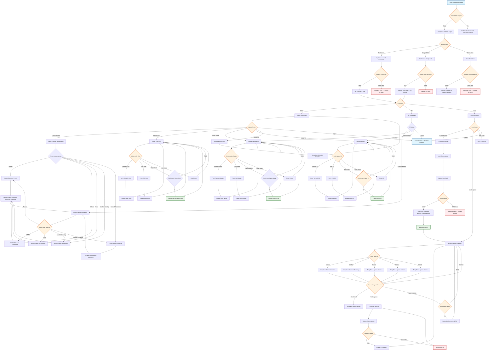

### Activity Diagram

```mermaid
graph TD
    A[User Mengakses Sistem] --> B{User Sudah Login?}
    B -->|Tidak| C[Tampilkan Halaman Login]
    B -->|Ya| D[Redirect ke Dashboard Berdasarkan Role]
    
    C --> E{Metode Login}
    E -->|Tradisional| F[Input Username & Password]
    E -->|Google OAuth| G[Redirect ke Google Auth]
    E -->|Daftar Baru| H[Form Registrasi]
    
    F --> I{Validasi Kredensial}
    I -->|Valid| J[Set Session & Role]
    I -->|Tidak Valid| K[Tampilkan Error & Kembali ke Login]
    
    G --> L{Google Auth Berhasil?}
    L -->|Ya| M[Simpan Data User & Set Session]
    L -->|Tidak| N[Kembali ke Login]
    
    H --> O{Validasi Form Registrasi}
    O -->|Valid| P[Simpan User Baru & Redirect ke Login]
    O -->|Tidak Valid| Q[Tampilkan Error & Kembali ke Form]
    
    J --> R{Role User}
    M --> R
    R -->|Admin| S[Admin Dashboard]
    R -->|RT| T[RT Dashboard]
    R -->|User| U[User Dashboard]
    
    U --> V{User Action}
    V -->|Buat Laporan| W[Form Buat Laporan]
    V -->|Lihat Laporan| X[Tampilkan Daftar Laporan]
    V -->|Edit Profil| Y[Form Edit Profil]
    V -->|Logout| Z[Clear Session & Redirect ke Login]
    
    W --> AA[Input Data Laporan]
    AA --> BB[Upload Foto Bukti]
    BB --> CC{Validasi Data}
    CC -->|Valid| DD[Simpan ke Database dengan Status Pending]
    CC -->|Tidak Valid| EE[Tampilkan Error & Kembali ke Form]
    
    DD --> FF[Notifikasi Sukses]
    FF --> X
    
    X --> GG{Filter Laporan}
    GG -->|Semua| HH[Tampilkan Semua Laporan]
    GG -->|Pending| II[Tampilkan Laporan Pending]
    GG -->|Proses| JJ[Tampilkan Laporan Proses]
    GG -->|Selesai| KK[Tampilkan Laporan Selesai]
    GG -->|Ditolak| LL[Tampilkan Laporan Ditolak]
    
    HH --> MM{User Action pada Laporan}
    II --> MM
    JJ --> MM
    KK --> MM
    LL --> MM
    
    MM -->|Lihat Detail| NN[Tampilkan Detail Laporan]
    MM -->|Edit Laporan| OO[Form Edit Laporan]
    MM -->|Hapus Laporan| PP{Konfirmasi Hapus}
    MM -->|Kembali| X
    
    PP -->|Ya| QQ[Hapus dari Database & File]
    PP -->|Tidak| X
    QQ --> X
    
    OO --> RR[Update Data Laporan]
    RR --> SS{Validasi Update}
    SS -->|Valid| TT[Simpan Perubahan]
    SS -->|Tidak Valid| UU[Tampilkan Error]
    TT --> X
    UU --> OO
    
    T --> VV{RT Action}
    VV -->|Kelola Laporan| WW[Daftar Laporan untuk RT]
    VV -->|Kelola Warga| XX[Kelola Data Warga]
    VV -->|Kelola KK| YY[Kelola Data KK]
    VV -->|Logout| Z
    
    WW --> ZZ{Action pada Laporan}
    ZZ -->|Proses| AAA[Update Status ke Proses]
    ZZ -->|Selesai| BBB[Update Status ke Completed]
    ZZ -->|Tolak| CCC[Update Status ke Rejected]
    ZZ -->|Kembali Pending| DDD[Update Status ke Pending]
    ZZ -->|Tambah Komentar| EEE[Form Tambah Komentar]
    
    AAA --> FFF[Simpan Status & Tambah Komentar Otomatis]
    BBB --> FFF
    CCC --> FFF
    DDD --> FFF
    
    EEE --> GGG[Simpan Komentar ke Database]
    GGG --> WW
    
    FFF --> WW
    
    S --> HHH{Admin Action}
    HHH -->|Kelola Laporan| III[Daftar Laporan untuk Admin]
    HHH -->|Kelola User| JJJ[Kelola Data User]
    HHH -->|Kelola Warga| XX
    HHH -->|Kelola KK| YY
    HHH -->|Monitoring| KKK[Dashboard Analytics]
    HHH -->|Logout| Z
    
    III --> LLL{Action pada Laporan}
    LLL -->|Proses| AAA
    LLL -->|Selesai| BBB
    LLL -->|Tolak| CCC
    LLL -->|Kembali Pending| DDD
    LLL -->|Tambah Komentar| EEE
    
    JJJ --> MMM{Action pada User}
    MMM -->|Tambah User| NNN[Form Tambah User]
    MMM -->|Edit User| OOO[Form Edit User]
    MMM -->|Hapus User| PPP{Konfirmasi Hapus User}
    MMM -->|Lihat Detail| QQQ[Detail User]
    
    NNN --> RRR[Simpan User Baru]
    OOO --> SSS[Update Data User]
    PPP -->|Ya| TTT[Hapus User & Data Terkait]
    PPP -->|Tidak| JJJ
    
    RRR --> JJJ
    SSS --> JJJ
    TTT --> JJJ
    QQQ --> JJJ
    
    XX --> UUU{Action pada Warga}
    UUU -->|Tambah Warga| VVV[Form Tambah Warga]
    UUU -->|Edit Warga| WWW[Form Edit Warga]
    UUU -->|Hapus Warga| XXX{Konfirmasi Hapus Warga}
    UUU -->|Lihat Detail| YYY[Detail Warga]
    
    VVV --> ZZZ[Simpan Data Warga]
    WWW --> AAAA[Update Data Warga]
    XXX -->|Ya| BBBB[Hapus Data Warga]
    XXX -->|Tidak| XX
    
    ZZZ --> XX
    AAAA --> XX
    BBBB --> XX
    YYY --> XX
    
    YY --> CCCC{Action pada KK}
    CCCC -->|Tambah KK| DDDD[Form Tambah KK]
    CCCC -->|Edit KK| EEEE[Form Edit KK]
    CCCC -->|Hapus KK| FFFF{Konfirmasi Hapus KK}
    CCCC -->|Lihat Detail| GGGG[Detail KK]
    
    DDDD --> HHHH[Simpan Data KK]
    EEEE --> IIII[Update Data KK]
    FFFF -->|Ya| JJJJ[Hapus Data KK]
    FFFF -->|Tidak| YY
    
    HHHH --> YY
    IIII --> YY
    JJJJ --> YY
    GGGG --> YY
    
    KKK --> KKKK[Tampilkan Statistik & Analytics]
    KKKK --> S
    
    %% Styling
    classDef startEnd fill:#e1f5fe,stroke:#01579b,stroke-width:2px
    classDef process fill:#f3e5f5,stroke:#4a148c,stroke-width:2px
    classDef decision fill:#fff3e0,stroke:#e65100,stroke-width:2px
    classDef error fill:#ffebee,stroke:#c62828,stroke-width:2px
    classDef success fill:#e8f5e8,stroke:#2e7d32,stroke-width:2px
    
    class A,Z startEnd
    class B,E,I,L,O,R,V,CC,GG,MM,PP,SS,ZZ,HHH,MMM,UUU,CCCC,FFFF decision
    class K,N,Q,EE,UU error
    class FF,TTT,BBBB,JJJJ success
```
