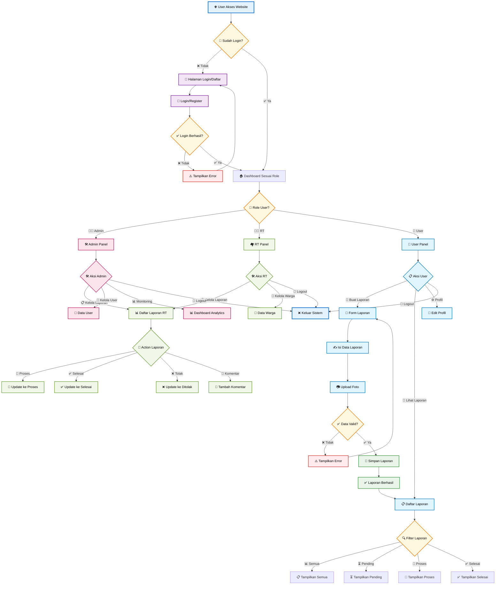

```mermaid
graph TD
    A[🌐 User Akses Website] --> B{🔐 Sudah Login?}
    B -->|❌ Tidak| C[📝 Halaman Login/Daftar]
    B -->|✅ Ya| D[🏠 Dashboard Sesuai Role]
    
    C --> E[🔑 Login/Register]
    E --> F{✅ Login Berhasil?}
    F -->|❌ Tidak| G[⚠️ Tampilkan Error]
    F -->|✅ Ya| D
    G --> C
    
    D --> H{👤 Role User?}
    H -->|👨‍💼 Admin| I[🛠️ Admin Panel]
    H -->|👨‍💻 RT| J[🏘️ RT Panel] 
    H -->|👤 User| K[📱 User Panel]
    
    K --> L{📋 Aksi User}
    L -->|📝 Buat Laporan| M[📄 Form Laporan]
    L -->|👀 Lihat Laporan| N[📋 Daftar Laporan]
    L -->|⚙️ Profil| O[👤 Edit Profil]
    L -->|🚪 Logout| P[❌ Keluar Sistem]
    
    M --> Q[✍️ Isi Data Laporan]
    Q --> R[📷 Upload Foto]
    R --> S{✅ Data Valid?}
    S -->|❌ Tidak| T[⚠️ Tampilkan Error]
    S -->|✅ Ya| U[💾 Simpan Laporan]
    T --> M
    U --> V[✅ Laporan Berhasil]
    V --> N
    
    N --> W{🔍 Filter Laporan}
    W -->|📊 Semua| X[📋 Tampilkan Semua]
    W -->|⏳ Pending| Y[⏳ Tampilkan Pending]
    W -->|🔄 Proses| Z[🔄 Tampilkan Proses]
    W -->|✅ Selesai| AA[✅ Tampilkan Selesai]
    
    J --> BB{🛠️ Aksi RT}
    BB -->|📋 Kelola Laporan| CC[📊 Daftar Laporan RT]
    BB -->|👥 Kelola Warga| DD[👥 Data Warga]
    BB -->|🚪 Logout| P
    
    CC --> EE{📝 Action Laporan}
    EE -->|🔄 Proses| FF[🔄 Update ke Proses]
    EE -->|✅ Selesai| GG[✅ Update ke Selesai]
    EE -->|❌ Tolak| HH[❌ Update ke Ditolak]
    EE -->|💬 Komentar| II[💬 Tambah Komentar]
    
    I --> JJ{🛠️ Aksi Admin}
    JJ -->|📋 Kelola Laporan| CC
    JJ -->|👥 Kelola User| KK[👥 Data User]
    JJ -->|📊 Monitoring| LL[📊 Dashboard Analytics]
    JJ -->|🚪 Logout| P
    
    %% Styling untuk visual yang menarik
    classDef startEnd fill:#e3f2fd,stroke:#1976d2,stroke-width:3px,color:#000
    classDef process fill:#f3e5f5,stroke:#7b1fa2,stroke-width:2px,color:#000
    classDef decision fill:#fff8e1,stroke:#f57c00,stroke-width:2px,color:#000
    classDef error fill:#ffebee,stroke:#d32f2f,stroke-width:2px,color:#000
    classDef success fill:#e8f5e8,stroke:#388e3c,stroke-width:2px,color:#000
    classDef user fill:#e1f5fe,stroke:#0277bd,stroke-width:2px,color:#000
    classDef rt fill:#f1f8e9,stroke:#689f38,stroke-width:2px,color:#000
    classDef admin fill:#fce4ec,stroke:#c2185b,stroke-width:2px,color:#000
    
    class A,P startEnd
    class C,E,M,Q,R,N,O,CC,DD,KK,LL process
    class B,F,H,L,S,W,BB,EE,JJ decision
    class G,T error
    class U,V,FF,GG,HH,II success
    class K,L,M,Q,R,N,O user
    class J,BB,CC,DD,EE,FF,GG,HH,II rt
    class I,JJ,KK,LL admin
```
