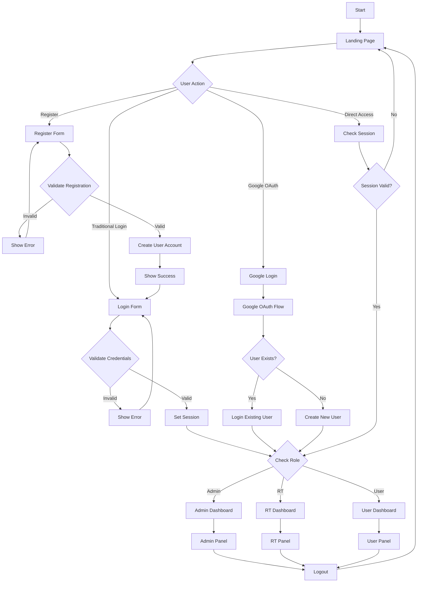

# FLOWCHART LENGKAP APLIKASI LAPORIN LINGKUNGAN v2.0

## 1. FLOWCHART UTAMA SISTEM (Updated)

Sistem ini dirancang untuk memberikan pengalaman yang modern, aman, dan user-friendly dalam pelaporan masalah lingkungan masyarakat.

