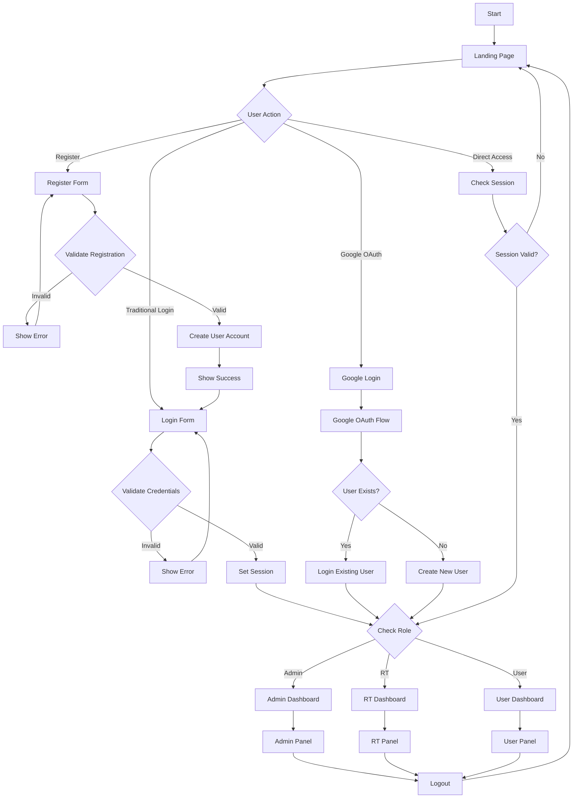

# FLOWCHART LENGKAP APLIKASI LAPORIN LINGKUNGAN v2.0

## 1. FLOWCHART UTAMA SISTEM (Updated)

## KESIMPULAN v2.0

Aplikasi Laporin Lingkungan v2.0 memiliki fitur-fitur modern dan peningkatan signifikan:

### 🌟 Fitur Baru
1. **Google OAuth Integration**: Login menggunakan akun Google
2. **Modern UI/UX**: Bootstrap 5.3.7 dengan custom styling
3. **Enhanced Security**: Improved validation dan security measures
4. **Better File Handling**: Advanced file upload dengan validasi
5. **Responsive Design**: Optimized untuk semua device

### 👥 Level Pengguna
1. **User** - Masyarakat yang dapat membuat dan melihat laporan
2. **RT** - Ketua RT yang dapat mengelola laporan dan data warga
3. **Admin** - Administrator yang memiliki akses penuh ke semua fitur

### 🔄 Alur Utama Aplikasi
1. **Authentication** - Login/Register dengan traditional atau Google OAuth
2. **Report Management** - Pembuatan, review, dan tracking laporan
3. **Data Management** - Pengelolaan data warga, KK, dan user
4. **Status Tracking** - Monitoring status laporan dari pending hingga completed
5. **File Management** - Upload dan management foto bukti laporan

### 🛠️ Teknologi
- **Backend**: PHP dengan modern security practices
- **Database**: MySQL dengan relasi antar tabel yang jelas
- **Frontend**: Bootstrap 5.3.7, Font Awesome, Custom CSS
- **Authentication**: Google OAuth 2.0 + Traditional login
- **File System**: Secure file upload dengan validasi

Sistem ini dirancang untuk memberikan pengalaman yang modern, aman, dan user-friendly dalam pelaporan masalah lingkungan masyarakat.

