# SWIM LANE DIAGRAM LAPORIN LINGKUNGAN v2.0

## 📋 DAFTAR ISI
1. [Overview Swim Lane](#overview-swim-lane)
2. [User Registration & Authentication](#user-registration--authentication)
3. [Laporan Creation Workflow](#laporan-creation-workflow)
4. [Laporan Management Workflow](#laporan-management-workflow)
5. [User Management Workflow](#user-management-workflow)
6. [Data Management Workflow](#data-management-workflow)
7. [System Maintenance Workflow](#system-maintenance-workflow)

---

## 1. OVERVIEW SWIM LANE

```mermaid
sequenceDiagram
    participant U as 👤 User<br/>Masyarakat
    participant RT as 🏘️ RT<br/>Ketua RT
    participant A as 👨‍💼 Admin<br/>Administrator
    participant S as 🔧 System<br/>Aplikasi
    participant DB as 💾 Database
    participant G as 🌐 Google OAuth
    participant F as 📁 File Server

    Note over U,F: Overview of all swim lanes and interactions
```

---

## 2. USER REGISTRATION & AUTHENTICATION

```mermaid
sequenceDiagram
    participant U as 👤 User<br/>Masyarakat
    participant S as 🔧 System<br/>Aplikasi
    participant DB as 💾 Database
    participant G as 🌐 Google OAuth
    participant E as 📧 Email Service

    Note over U,E: User Registration & Authentication Workflow

    %% Traditional Registration
    U->>S: Fill registration form
    S->>S: Validate input data
    S->>DB: Check username availability
    alt Username available
        S->>S: Hash password
        S->>DB: Insert new user
        S->>E: Send welcome email
        S->>U: Show success message
    else Username taken
        S->>U: Show error message
    end

    %% Traditional Login
    U->>S: Enter username/password
    S->>S: Validate credentials
    S->>DB: Check user data
    alt Valid credentials
        S->>S: Create session
        S->>U: Redirect to dashboard
    else Invalid credentials
        S->>U: Show error message
    end

    %% Google OAuth Login
    U->>S: Click Google Login
    S->>G: Redirect to Google OAuth
    G->>U: User authorization
    U->>G: Authorize application
    G->>S: Return auth code
    S->>G: Exchange code for token
    G->>S: Return user info
    S->>DB: Check/create user
    S->>S: Create session
    S->>U: Redirect to dashboard
```

---

## 3. LAPORAN CREATION WORKFLOW

```mermaid
sequenceDiagram
    participant U as 👤 User<br/>Masyarakat
    participant S as 🔧 System<br/>Aplikasi
    participant DB as 💾 Database
    participant F as 📁 File Server
    participant RT as 🏘️ RT<br/>Ketua RT
    participant A as 👨‍💼 Admin<br/>Administrator

    Note over U,A: Laporan Creation & Processing Workflow

    %% User creates laporan
    U->>S: Access buat laporan form
    S->>U: Display form
    U->>S: Fill laporan details
    U->>S: Upload photo (optional)
    
    %% System processes laporan
    S->>S: Validate input data
    S->>S: Validate photo file
    alt Photo uploaded
        S->>F: Upload photo to server
        F->>S: Return file path
    end
    
    S->>DB: Save laporan data
    DB->>S: Confirm save
    S->>U: Show success message
    
    %% Notification to RT/Admin
    S->>DB: Update notification queue
    S->>RT: Send notification (if RT assigned)
    S->>A: Send notification (if admin monitoring)
    
    %% RT/Admin review process
    RT->>S: Access laporan management
    S->>DB: Fetch laporan data
    DB->>S: Return laporan list
    S->>RT: Display laporan
    
    RT->>S: Update laporan status
    S->>DB: Update status
    S->>U: Send status notification
```

---

## 4. LAPORAN MANAGEMENT WORKFLOW

```mermaid
sequenceDiagram
    participant RT as 🏘️ RT<br/>Ketua RT
    participant A as 👨‍💼 Admin<br/>Administrator
    participant S as 🔧 System<br/>Aplikasi
    participant DB as 💾 Database
    participant U as 👤 User<br/>Masyarakat
    participant E as 📧 Email Service

    Note over RT,E: Laporan Management & Processing Workflow

    %% RT/Admin access laporan management
    RT->>S: Login to system
    A->>S: Login to system
    
    %% View laporan list
    RT->>S: Access kelola laporan
    A->>S: Access kelola laporan
    S->>DB: Fetch laporan data
    DB->>S: Return laporan list
    S->>RT: Display laporan list
    S->>A: Display laporan list
    
    %% Process specific laporan
    RT->>S: Select laporan for review
    A->>S: Select laporan for review
    S->>DB: Fetch laporan details
    DB->>S: Return laporan details
    S->>RT: Display laporan detail
    S->>A: Display laporan detail
    
    %% Update laporan status
    RT->>S: Update status to "Dalam Proses"
    A->>S: Update status to "Dalam Proses"
    S->>DB: Update status
    S->>U: Send status notification
    S->>E: Send email notification
    
    %% Add comments
    RT->>S: Add comment to laporan
    A->>S: Add comment to laporan
    S->>DB: Save comment
    S->>U: Send comment notification
    
    %% Complete laporan
    RT->>S: Update status to "Selesai"
    A->>S: Update status to "Selesai"
    S->>DB: Update final status
    S->>U: Send completion notification
    S->>E: Send completion email
```

---

## 5. USER MANAGEMENT WORKFLOW

---

## 6. DATA MANAGEMENT WORKFLOW

```mermaid
sequenceDiagram
    participant A as 👨‍💼 Admin<br/>Administrator
    participant S as 🔧 System<br/>Aplikasi
    participant DB as 💾 Database
    participant B as 💿 Backup Server
    participant E as 📊 Export Service
    participant I as 📥 Import Service

    Note over A,I: Data Management & Analytics Workflow

    %% Data backup process
    A->>S: Initiate backup process
    S->>DB: Create backup snapshot
    DB->>S: Return backup data
    S->>B: Upload backup to server
    B->>S: Confirm backup success
    S->>A: Show backup status
    
    %% Data export
    A->>S: Request data export
    S->>DB: Fetch export data
    DB->>S: Return data
    S->>E: Process export format
    E->>S: Return export file
    S->>A: Download export file
    
    %% Data import
    A->>S: Upload import file
    S->>I: Process import file
    I->>S: Validate import data
    S->>S: Check data integrity
    S->>DB: Import data
    DB->>S: Confirm import
    S->>A: Show import results
    
    %% Analytics and statistics
    A->>S: Access dashboard
    S->>DB: Fetch analytics data
    DB->>S: Return statistics
    S->>S: Process analytics
    S->>A: Display charts/graphs
    
    %% System monitoring
    S->>S: Monitor system performance
    S->>DB: Check database health
    S->>S: Log system metrics
    S->>A: Send alerts if needed
```

---

## 7. SYSTEM MAINTENANCE WORKFLOW

```mermaid
sequenceDiagram
    participant A as 👨‍💼 Admin<br/>Administrator
    participant S as 🔧 System<br/>Aplikasi
    participant DB as 💾 Database
    participant L as 📝 Log System
    participant M as 🔧 Maintenance Mode
    participant U as 👤 Users

    Note over A,U: System Maintenance & Monitoring Workflow

    %% System health check
    S->>S: Perform health check
    S->>DB: Check database connection
    S->>S: Monitor system resources
    S->>L: Log system status
    
    %% Maintenance mode activation
    A->>S: Activate maintenance mode
    S->>M: Enable maintenance
    S->>U: Show maintenance page
    S->>L: Log maintenance start
    
    %% System updates
    A->>S: Initiate system update
    S->>M: Ensure maintenance mode
    S->>S: Backup current system
    S->>S: Apply updates
    S->>S: Test system functionality
    S->>M: Disable maintenance mode
    S->>U: Restore normal access
    S->>L: Log update completion
    
    %% Error handling
    S->>S: Detect system error
    S->>L: Log error details
    S->>A: Send error alert
    S->>S: Attempt auto-recovery
    alt Recovery successful
        S->>L: Log recovery success
    else Recovery failed
        S->>A: Send critical alert
        S->>M: Enable emergency mode
    end
    
    %% Performance optimization
    A->>S: Request performance report
    S->>DB: Analyze query performance
    S->>S: Generate optimization suggestions
    S->>A: Display recommendations
    A->>S: Apply optimizations
    S->>DB: Execute optimizations
    S->>S: Monitor performance improvement
```

---

## 📋 SUMMARY

Swim Lane Diagram Laporin Lingkungan v2.0 menunjukkan **7 workflow utama** yang mencakup:

### 🔐 **Authentication & Registration**
- Traditional registration dan login
- Google OAuth integration
- Session management

### 📝 **Laporan Creation**
- User input dan validation
- Photo upload processing
- Database storage
- Notification system

### 🏗️ **Laporan Management**
- RT/Admin review process
- Status updates
- Comment system
- User notifications

### 👥 **User Management**
- Admin user management
- RT warga management
- KK (Kartu Keluarga) management
- Data validation

### 💾 **Data Management**
- Backup dan restore
- Import/export functionality
- Analytics dan statistics
- System monitoring

### 🔧 **System Maintenance**
- Health monitoring
- Maintenance mode
- System updates
- Error handling
- Performance optimization

### 🔄 **Key Interactions**
- **User ↔ System**: Form submission, file upload
- **RT ↔ System**: Laporan review, warga management
- **Admin ↔ System**: User management, system maintenance
- **System ↔ Database**: Data operations, queries
- **System ↔ External**: Google OAuth, email service, file server

Setiap swim lane menunjukkan tanggung jawab dan interaksi yang jelas antara actor yang berbeda, memastikan workflow yang terstruktur dan mudah dipahami untuk pengembangan dan maintenance sistem.
