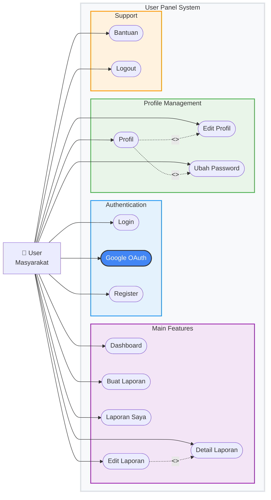

# USE CASE DIAGRAM LAPORIN LINGKUNGAN v2.0

## 📋 DAFTAR ISI
1. [User Use Cases](#user-use-cases)
2. [RT Use Cases](#rt-use-cases)
3. [Admin Use Cases](#admin-use-cases)

---

---

## 1. USER USE CASES

---

## 2. RT USE CASES

---

## 3. ADMIN USE CASES

---

Sistem ini dirancang dengan **role-based access control** yang jelas, dimana setiap role memiliki permission yang berbeda sesuai dengan tanggung jawabnya dalam sistem pelaporan lingkungan.
