# USE CASE DIAGRAM LAPORIN LINGKUNGAN v2.0

## 📋 DAFTAR ISI
1. [Overview Use Case](#overview-use-case)
2. [User Use Cases](#user-use-cases)
3. [RT Use Cases](#rt-use-cases)
4. [Admin Use Cases](#admin-use-cases)
5. [System Use Cases](#system-use-cases)
6. [Extended Use Cases](#extended-use-cases)
7. [Use Case Descriptions](#use-case-descriptions)

---

## 1. OVERVIEW USE CASE

```mermaid
flowchart LR
    actor_user[👤 User<br/>Masyarakat]
    actor_rt[🏘️ RT<br/>Ketua RT]
    actor_admin[👨‍💼 Admin<br/>Administrator]

    subgraph System[Aplikasi Laporin Lingkungan v2.0]
        subgraph Auth[Authentication]
            UC_Login([Login])
            UC_GoogleLogin([Google OAuth])
            UC_Register([Register])
            UC_Logout([Logout])
        end
        
        subgraph UserFeatures[User Features]
            UC_Dashboard([Dashboard])
            UC_BuatLaporan([Buat Laporan])
            UC_LihatLaporan([Lihat Laporan])
            UC_EditLaporan([Edit Laporan])
            UC_Profil([Kelola Profil])
            UC_Bantuan([Bantuan])
        end
        
        subgraph Management[Management Features]
            UC_KelolaLaporan([Kelola Laporan])
            UC_KelolaWarga([Kelola Warga])
            UC_KelolaKK([Kelola KK])
            UC_KelolaUser([Kelola User])
        end
        
        subgraph SystemFeatures[System Features]
            UC_UploadFoto([Upload Foto])
            UC_Statistik([Statistik])
            UC_Komentar([Komentar])
        end
    end

    %% User connections
    actor_user --> UC_Register
    actor_user --> UC_Login
    actor_user --> UC_GoogleLogin
    actor_user --> UC_Dashboard
    actor_user --> UC_BuatLaporan
    actor_user --> UC_LihatLaporan
    actor_user --> UC_EditLaporan
    actor_user --> UC_Profil
    actor_user --> UC_Bantuan
    actor_user --> UC_Logout

    %% RT connections
    actor_rt --> UC_Login
    actor_rt --> UC_Dashboard
    actor_rt --> UC_KelolaLaporan
    actor_rt --> UC_KelolaWarga
    actor_rt --> UC_KelolaKK
    actor_rt --> UC_Statistik
    actor_rt --> UC_Profil
    actor_rt --> UC_Logout

    %% Admin connections
    actor_admin --> UC_Login
    actor_admin --> UC_Dashboard
    actor_admin --> UC_KelolaLaporan
    actor_admin --> UC_KelolaWarga
    actor_admin --> UC_KelolaKK
    actor_admin --> UC_KelolaUser
    actor_admin --> UC_Statistik
    actor_admin --> UC_Profil
    actor_admin --> UC_Logout

    %% Extend relationships
    UC_BuatLaporan -.->|<<extend>>| UC_UploadFoto
    UC_KelolaLaporan -.->|<<include>>| UC_Statistik
    UC_KelolaLaporan -.->|<<extend>>| UC_Komentar

    style System fill:#f8f9fa,stroke:#dee2e6,stroke-width:3px
    style Auth fill:#e3f2fd,stroke:#2196f3,stroke-width:2px
    style UserFeatures fill:#f3e5f5,stroke:#9c27b0,stroke-width:2px
    style Management fill:#e8f5e8,stroke:#4caf50,stroke-width:2px
    style SystemFeatures fill:#fff3e0,stroke:#ff9800,stroke-width:2px
    style UC_GoogleLogin fill:#4285f4,stroke:#333,stroke-width:2px,color:#fff
    style UC_Statistik fill:#ffd93d,stroke:#333,stroke-width:2px,color:#000
```

---

## 2. USER USE CASES

---

## 3. RT USE CASES

```mermaid
flowchart LR
    actor_rt[🏘️ RT<br/>Ketua RT]
    
    subgraph RTSystem[RT Panel System]
        subgraph Auth[Authentication]
            UC_Login([Login])
        end
        
        subgraph Main[Main Features]
            UC_Dashboard([Dashboard])
            UC_KelolaLaporan([Kelola Laporan])
            UC_KelolaWarga([Kelola Warga])
            UC_KelolaKK([Kelola KK])
        end
        
        subgraph Management[Management]
            UC_UpdateStatus([Update Status])
            UC_TambahKomentar([Tambah Komentar])
            UC_DetailLaporan([Detail Laporan])
            UC_StatistikRT([Statistik RT])
        end
        
        subgraph Profile[Profile]
            UC_Profil([Profil])
            UC_Logout([Logout])
        end
    end

    %% RT connections
    actor_rt --> UC_Login
    actor_rt --> UC_Dashboard
    actor_rt --> UC_KelolaLaporan
    actor_rt --> UC_KelolaWarga
    actor_rt --> UC_KelolaKK
    actor_rt --> UC_UpdateStatus
    actor_rt --> UC_TambahKomentar
    actor_rt --> UC_DetailLaporan
    actor_rt --> UC_StatistikRT
    actor_rt --> UC_Profil
    actor_rt --> UC_Logout

    %% Include relationships
    UC_KelolaLaporan -.->|<<include>>| UC_UpdateStatus
    UC_KelolaLaporan -.->|<<include>>| UC_DetailLaporan
    UC_KelolaLaporan -.->|<<extend>>| UC_TambahKomentar
    UC_Dashboard -.->|<<include>>| UC_StatistikRT

    style RTSystem fill:#f8f9fa,stroke:#dee2e6,stroke-width:3px
    style Auth fill:#e3f2fd,stroke:#2196f3,stroke-width:2px
    style Main fill:#f3e5f5,stroke:#9c27b0,stroke-width:2px
    style Management fill:#e8f5e8,stroke:#4caf50,stroke-width:2px
    style Profile fill:#fff3e0,stroke:#ff9800,stroke-width:2px
    style UC_StatistikRT fill:#ffd93d,stroke:#333,stroke-width:2px,color:#000
```

---

## 4. ADMIN USE CASES

```mermaid
flowchart LR
    actor_admin[👨‍💼 Admin<br/>Administrator]
    
    subgraph AdminSystem[Admin Panel System]
        subgraph Auth[Authentication]
            UC_Login([Login])
        end
        
        subgraph Main[Main Features]
            UC_Dashboard([Dashboard])
            UC_KelolaLaporan([Kelola Laporan])
            UC_KelolaWarga([Kelola Warga])
            UC_KelolaKK([Kelola KK])
            UC_KelolaUser([Kelola User])
        end
        
        subgraph Management[Management]
            UC_UpdateStatus([Update Status])
            UC_TambahKomentar([Tambah Komentar])
            UC_DetailLaporan([Detail Laporan])
            UC_StatistikSistem([Statistik Sistem])
        end
        
        subgraph System[System]
            UC_Backup([Backup Data])
            UC_Maintenance([Maintenance])
            UC_Logout([Logout])
        end
    end

    %% Admin connections
    actor_admin --> UC_Login
    actor_admin --> UC_Dashboard
    actor_admin --> UC_KelolaLaporan
    actor_admin --> UC_KelolaWarga
    actor_admin --> UC_KelolaKK
    actor_admin --> UC_KelolaUser
    actor_admin --> UC_UpdateStatus
    actor_admin --> UC_TambahKomentar
    actor_admin --> UC_DetailLaporan
    actor_admin --> UC_StatistikSistem
    actor_admin --> UC_Backup
    actor_admin --> UC_Maintenance
    actor_admin --> UC_Logout

    %% Include relationships
    UC_KelolaLaporan -.->|<<include>>| UC_UpdateStatus
    UC_KelolaLaporan -.->|<<include>>| UC_DetailLaporan
    UC_KelolaLaporan -.->|<<extend>>| UC_TambahKomentar
    UC_Dashboard -.->|<<include>>| UC_StatistikSistem
    UC_Dashboard -.->|<<extend>>| UC_Backup

    style AdminSystem fill:#f8f9fa,stroke:#dee2e6,stroke-width:3px
    style Auth fill:#e3f2fd,stroke:#2196f3,stroke-width:2px
    style Main fill:#f3e5f5,stroke:#9c27b0,stroke-width:2px
    style Management fill:#e8f5e8,stroke:#4caf50,stroke-width:2px
    style System fill:#fff3e0,stroke:#ff9800,stroke-width:2px
    style UC_StatistikSistem fill:#ffd93d,stroke:#333,stroke-width:2px,color:#000
```

---

## 5. SYSTEM USE CASES

---

## 6. EXTENDED USE CASES

---

## 7. USE CASE DESCRIPTIONS

### 🔐 Authentication Use Cases

#### UC_Login
- **Actor**: User, RT, Admin
- **Description**: User memasukkan username dan password untuk login
- **Precondition**: User memiliki akun yang valid
- **Main Flow**: 
  1. User memasukkan username dan password
  2. System memvalidasi credentials
  3. System membuat session
  4. System redirect ke dashboard sesuai role
- **Postcondition**: User berhasil login dan dapat mengakses fitur sesuai role

#### UC_GoogleOAuth
- **Actor**: User
- **Description**: User login menggunakan akun Google
- **Precondition**: User memiliki akun Google
- **Main Flow**:
  1. User klik tombol Google Login
  2. System redirect ke Google OAuth
  3. User authorize aplikasi
  4. Google return auth code
  5. System exchange code untuk token
  6. System get user info dari Google
  7. System create/update user di database
  8. System create session dan redirect
- **Postcondition**: User berhasil login dengan Google account

#### UC_Register
- **Actor**: User
- **Description**: User membuat akun baru
- **Precondition**: User belum memiliki akun
- **Main Flow**:
  1. User mengisi form registrasi
  2. System validasi input
  3. System check username availability
  4. System hash password
  5. System insert user ke database
  6. System show success message
- **Postcondition**: User account berhasil dibuat

### 📊 Main Feature Use Cases

#### UC_BuatLaporan
- **Actor**: User
- **Description**: User membuat laporan masalah lingkungan
- **Precondition**: User sudah login
- **Main Flow**:
  1. User mengisi form laporan
  2. User upload foto (opsional)
  3. System validasi input
  4. System save laporan ke database
  5. System show success message
- **Postcondition**: Laporan berhasil dibuat dengan status pending

#### UC_KelolaLaporan
- **Actor**: RT, Admin
- **Description**: RT/Admin mengelola laporan dari user
- **Precondition**: RT/Admin sudah login
- **Main Flow**:
  1. System display semua laporan
  2. RT/Admin review laporan
  3. RT/Admin update status
  4. RT/Admin tambah komentar (opsional)
  5. System update database
- **Postcondition**: Status laporan berhasil diupdate

#### UC_KelolaWarga
- **Actor**: RT, Admin
- **Description**: RT/Admin mengelola data warga
- **Precondition**: RT/Admin sudah login
- **Main Flow**:
  1. System display data warga
  2. RT/Admin tambah/edit/hapus warga
  3. System validasi input
  4. System update database
- **Postcondition**: Data warga berhasil diupdate

### 🔧 System Use Cases

#### UC_FileUpload
- **Actor**: User
- **Description**: System memproses upload file foto
- **Precondition**: User memilih file untuk upload
- **Main Flow**:
  1. System validasi file type
  2. System check file size
  3. System generate unique filename
  4. System upload file ke server
  5. System save filename ke database
- **Postcondition**: File berhasil diupload dan tersimpan

#### UC_Security
- **Actor**: System
- **Description**: System melakukan security check
- **Precondition**: User melakukan request
- **Main Flow**:
  1. System check session validity
  2. System check user role
  3. System validate input
  4. System check SQL injection
  5. System process request
- **Postcondition**: Request diproses dengan aman

#### UC_Validation
- **Actor**: System
- **Description**: System memvalidasi input user
- **Precondition**: User submit form
- **Main Flow**:
  1. System check required fields
  2. System validate data format
  3. System check data length
  4. System sanitize input
- **Postcondition**: Input valid dan aman untuk diproses

---

## 📋 SUMMARY

Aplikasi Laporin Lingkungan v2.0 memiliki **18 use case utama** yang dibagi menjadi beberapa kategori:

### 🔐 Authentication (3 use cases)
- Login tradisional
- Google OAuth
- Register

### 👤 User Features (6 use cases)
- Dashboard
- Buat Laporan
- Lihat Laporan
- Edit Laporan
- Kelola Profil
- Bantuan

### 🏘️ RT Features (8 use cases)
- Semua fitur user + kelola laporan, warga, KK
- Statistik RT
- Update status laporan

### 👨‍💼 Admin Features (10 use cases)
- Semua fitur RT + kelola user
- Statistik sistem
- Backup dan maintenance

### 🔧 System Features (5 use cases)
- File upload
- Security
- Validation
- Database operations
- Session management

### 📈 Extended Features (6 use cases)
- Report workflow
- Analytics
- Data management
- Notifications

Sistem ini dirancang dengan **role-based access control** yang jelas, dimana setiap role memiliki permission yang berbeda sesuai dengan tanggung jawabnya dalam sistem pelaporan lingkungan.
